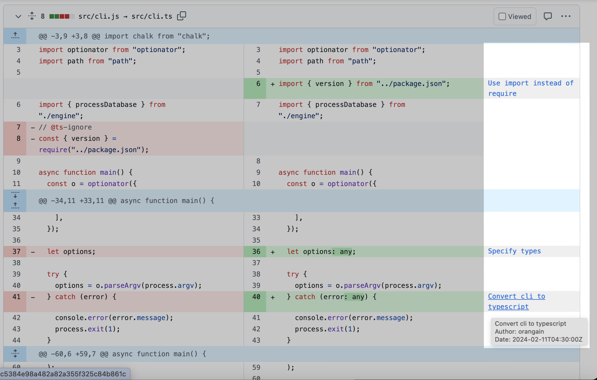

# Contextual GitHub Review

A Chrome extension that provides contextual information for GitHub Pull Requests.

## Features

- Shows commit information for the added lines in the diff view.
  - This helps reviewers understand the history and context of changes without needing to switch tabs or look up commits separately.
- Adds a "Conversations" button to the diff view.
  - This button allows users to quickly view the pull request description and comments in the popover without leaving the diff view.

## Installation

1. Clone or download this repository
2. Open Chrome and navigate to `chrome://extensions/`
3. Enable "Developer mode" in the top right
4. Click "Load unpacked" and select the extension directory
5. The extension will be installed and ready to use

## Configuration

1. Click the extension icon in the Chrome toolbar
2. Enter a GitHub Personal Access Token
   - This is required for fetching blame information using GitHub's GraphQL API.
3. Click "Save Settings"

### How to Create a GitHub Token

1. Go to GitHub Settings → Developer settings → Personal access tokens → [Fine-grained personal access tokens](https://github.com/settings/personal-access-tokens)
2. Click "Generate new token"
3. Configure the token as follows:
   - Token name: e.g., "Contextual GitHub Review Extension"
   - Expiration: Set as needed (e.g., 90 days)
   - Repository access: Choose "All repositories" or specific repositories
   - Permissions → Repository permissions:
     - Contents: Read-only Access
4. Click "Generate token"
5. Copy the generated token and paste it into the extension settings

## Usage

1. Navigate to "Files changed" tab of any GitHub Pull Request
2. The extension automatically detects diff lines and fetches blame information
3. Blame info appears beside each added line in the diff view
4. Hover over commit message to see the full commit message, author, and date

## Technical Details

- Uses GitHub's GraphQL API for blame information
- Implements caching to reduce API calls
- Observes DOM changes to handle dynamic content loading

## Limitations

- Rate limited by GitHub API
- May not work with very large files due to API response size limits

## Development

The extension consists of:
- `manifest.json` - Extension configuration
- `content.js` - Main logic for detecting diffs and showing blame info
- `background.js` - Service worker for handling extension lifecycle
- `popup.{html|js}` - Settings interface
- `content.css` - Styling for blame information display

## License

MIT License